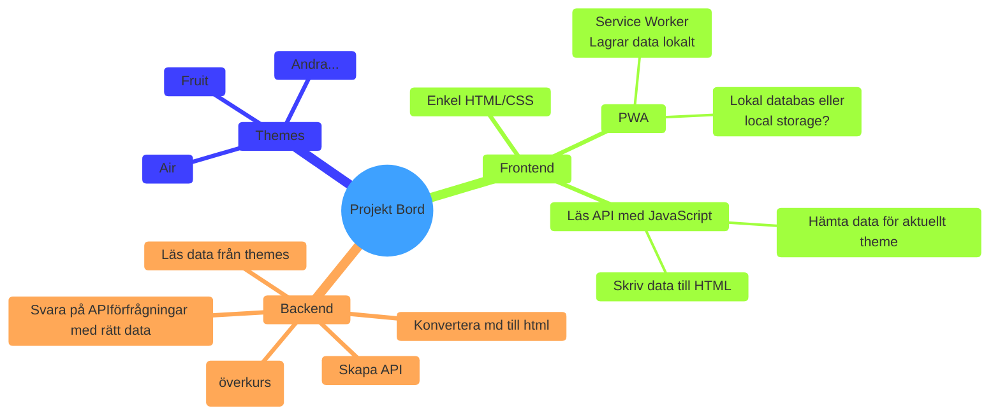

# Översikt över projekt Bord 

Detta dokument innehåller en enkel överblick över de olika komponenterna i projekt bord. 

Projektet kommer skrivas med HTML, CSS, MarkDown, SVG och JavaScript. Ramverk och verktyg kommer vara Node.js, NPM Scripts och diverse testmjukvaror. 

Tjänster som används kommer vara GitHub och Netlify. 

### Frontend 

Den primära delen som slutkund kommer i kontakt med är frontenden. En PWA som ligger i ett eget repocitory. Denna PWA testkörs först på GitHub Pages, men under drift kommer den köras på Netlify. Varje ny release kommer skickas till Netlify. 

### Backend 

Vår backend kommer skrivas i Node.js och köras på GitHub Pages. Huvuduppgiften är att svara via ett API och mellanlagra data i en databas. 

Backend skall tillhandahålla ett API som tillåter frontend att identifiera sig samt förmedla vilket tema som skall användas. Med denna informationen skall backend skicka tillbaka korrekta filer. 

### Themes 

Varje enskild kund kommer återfinnas i sina egna repon. Varje repo kommer innehålla content i form av markdown-filer och SVG-filer. 

## Flöde 

Slutanvändares browser går till en URL. Denna URL innehåller info om vilket tema som skall användas, det vill säga vilken kund det handlar om. Vår frontend skickar den informationen vidare till vår backend via dess API. 

Backend gör om det valda temat från markdown till html/css/svg och sänder över till frontend, som renderar detta i slutanvändares browser. 
